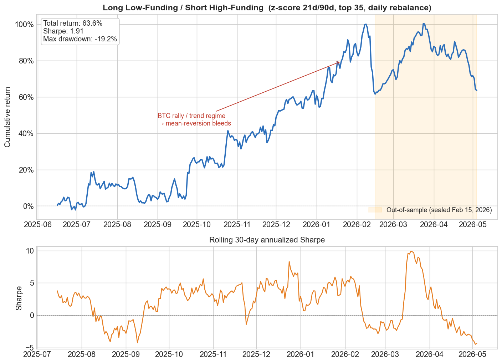
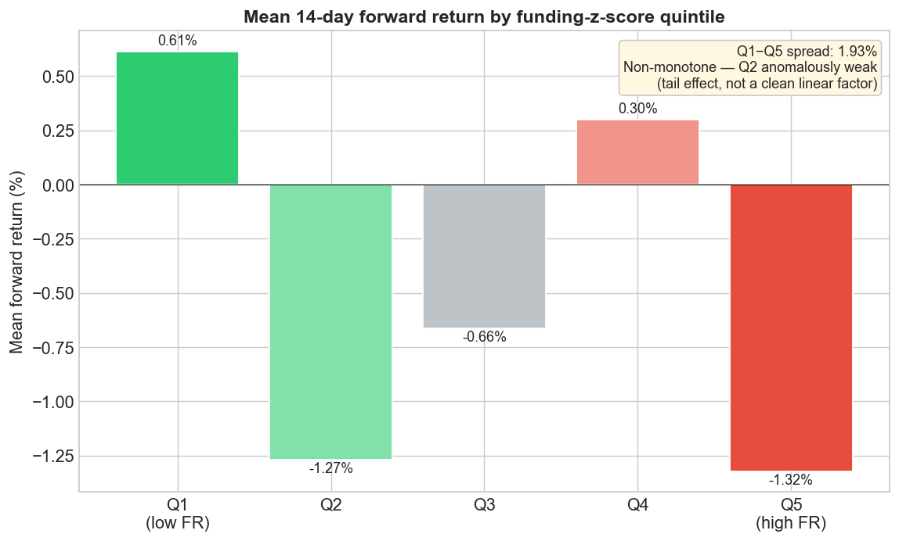
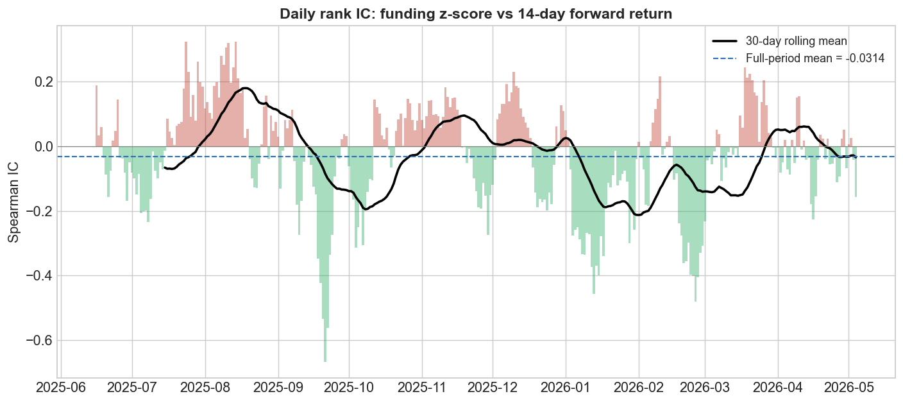
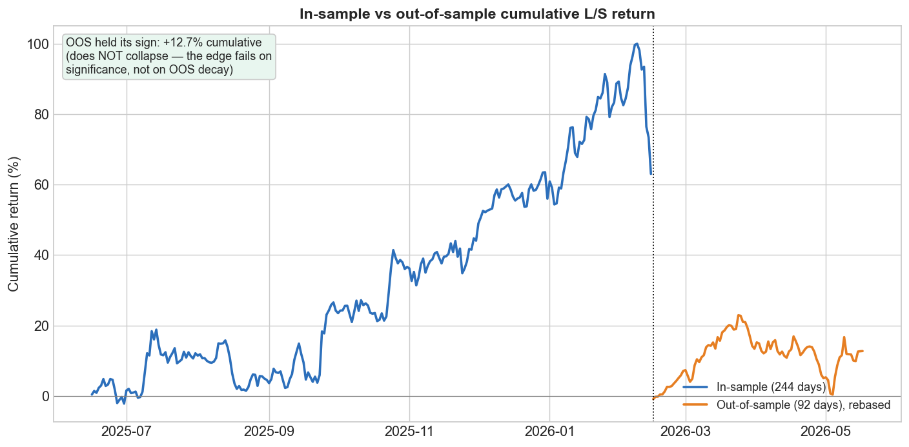
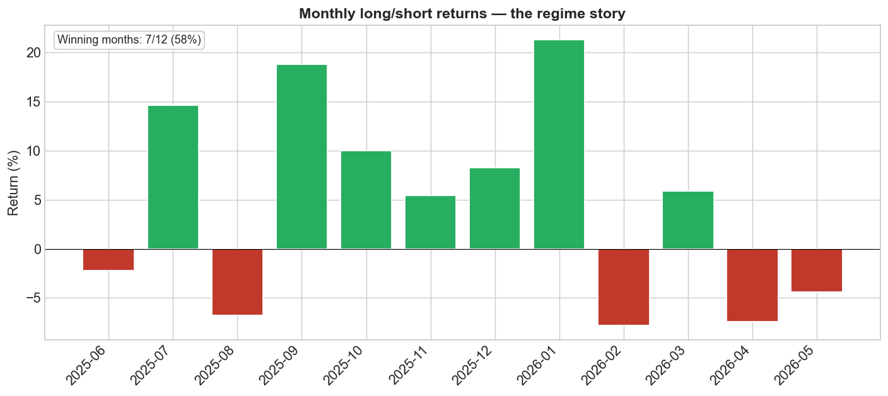

## Executive summary

We build and rigorously stress-test a single cross-sectional factor: **funding-rate
mean reversion** on Hyperliquid perpetual futures. The economic idea is clean — a
perp's funding rate is a real-money readout of how crowded and over-leveraged the
positioning is, and crowded leveraged trades tend to mean-revert. The tradeable
expression is market-neutral: each day, **go long the lowest-funding coins and short
the highest-funding coins**, equal-weighted, rebalanced daily.

In a backtest the factor looks like a winner: **+63.6% cumulative return, Sharpe 1.91,
−19% max drawdown** over ~1 year. That is exactly the moment to distrust it. We then
attack the result with the standard overfitting defenses, formalized as a four-gate
deploy/don't-deploy scorecard:

| Gate | Question | Result |
|------|----------|:------:|
| 1. Significance | Significant after multiple-testing correction? | **FAIL** |
| 2. Sign stability | Positive in-sample *and* out-of-sample? | PASS |
| 3. Overfitting | Beats the Deflated-Sharpe search penalty? | **FAIL** |
| 4. Costs | Survives realistic (and 2×) trading frictions? | PASS |

**Verdict: 2 of 4 → NOT DEPLOYABLE.** And the *way* it fails is the finding. This is
not a strategy that loses money — it makes a lot, survives costs, and even carries into
out-of-sample. It fails only on the two tests built to detect *luck*: statistical
significance after correcting for the search, and the Deflated-Sharpe penalty for how
hard we searched. That combination is the textbook fingerprint of data-mining. Per the
competition's own framing — *"we are looking for the best thinking … a strategy with a
negative Sharpe that is correctly understood will score better than impressive
backtested returns with no critical analysis"* — **the honest null is the deliverable.**

> **Scope.** This is a deliberately *single-factor* study. It stands on funding-rate
> mean reversion alone; there is no second factor and no multi-factor blend. All code
> and data are in the accompanying GitHub repository and reproduce every number below
> (see the Reproducibility appendix).

---

## 1. The thesis — why this factor should work

Perpetual futures have no expiry, so an exchange uses a **funding rate** to keep the
perp price tethered to spot. When a perp trades above spot — because too many traders
are long and bidding it up — longs pay shorts a periodic funding fee (positive
funding). When it trades below spot, shorts pay longs (negative funding). The funding
rate is therefore a *direct, dollar-denominated readout of positioning crowding*: how
lopsided the leveraged crowd is, and how much it costs them to stay there.

The economic claim follows in two steps:

1. **Extreme funding marks a crowded, over-leveraged trade.** Very positive funding
   means longs are crowded and paying steep carry to hold on; very negative funding
   means shorts are crowded.
2. **Crowded leveraged positioning mean-reverts.** Crowded longs are fragile — they pay
   to hold, they are vulnerable to liquidation cascades, and the marginal buyer is
   exhausted. So coins with *extremely high* funding should **underperform**, and coins
   with *extremely negative* funding should **outperform**, as the crowd unwinds.

This is the same intuition as **Betting Against Beta** (Frazzini & Pedersen): the
over-leveraged, over-loved end of the cross-section earns a *lower* future return than
its risk would suggest, because leverage-constrained traders bid it up. Funding is just
a cleaner, real-money thermometer for that crowding than beta is.

**The tradeable expression.** Rank the universe each day by a funding *z-score* — how
extreme today's funding is versus the coin's own recent history — then go long the
lowest-z names and short the highest-z names, equal-weighted and market-neutral:

```
z = ( mean_21d(funding) − mean_90d(funding) ) / std_90d(funding)
```

The z-score (rather than raw funding) matters because each coin has its own baseline
funding level; we care about how *unusually* crowded a coin is relative to itself, not
its absolute rate.

**Three reasons to be suspicious from the start** — stated up front because honest
framing is the point:

- **Crypto is momentum-heavy and regime-driven.** Mean reversion and momentum are
  opposite bets; in a strong trend the crowded longs are *right* and a mean-reversion
  factor bleeds. Any edge here is likely *regime-conditional*, not universal.
- **Funding signals are noisy and fast-decaying.** The "right" lookback windows are not
  obvious, which invites parameter mining.
- **The data is short and survivorship-prone.** One year of history on a live-exchange
  universe is exactly where a backtest can look great for reasons that won't repeat.

So the project was built in two halves: first *find* the best-looking version of the
factor, then *attack* it as a skeptic would.

---

## 2. Data & pipeline

- **Source.** Hyperliquid `info` API — free, no key, works in the US (Binance futures is
  geo-blocked here). Endpoints: `metaAndAssetCtxs` (universe + 24h volume),
  `fundingHistory` (hourly funding, ~24/day, paginated 500/req), `candleSnapshot`
  (daily OHLCV).
- **Coverage.** ~1 year (May 2025 – May 2026), **top-35 coins by 24h volume**,
  ~246k funding records and ~10.7k daily candles.
- **Build (`data_pipeline.py`).** `get_top_perp_symbols` → `pull_funding_rates` →
  `pull_ohlcv` → `build_funding_features` (daily funding + rolling z-score) →
  `build_panel` (merge + forward returns `ret_1d/7d/14d/21d`). Output parquet files are
  committed under `data/` so the analysis reproduces without any API calls.
- **Biases documented in-code (not hidden).** *Survivorship*: the live universe silently
  excludes coins delisted before the pull date, deleting losers and flattering returns.
  *Point-in-time*: coins are ranked by *today's* volume, so a name now in the top-35 is
  included with its full history even if it was obscure a year ago (7 coins listed
  mid-study). Neither is fully fixable without a historical-universe snapshot API that
  Hyperliquid does not provide — so both are disclosed, not papered over.
- **A real bug, fixed and pinned.** `build_panel` originally computed forward returns by
  row-shift, which would let a return silently span a missing day. It now reindexes each
  symbol onto a contiguous daily grid so a gap-spanning return becomes `NaN` rather than
  a wrong number. The fix is a no-op on the current gap-free panel (rebuilt panel is
  byte-identical) and is guarded by `test_data_pipeline.py` (4/4 pass).

---

## 3. Methodology — signal and backtest construction

- **Signal:** the 21d/90d funding z-score above, computed per coin from daily funding
  (intraday funding summed to a daily total).
- **Parameters:** short window 21d, long window 90d, holding horizon 14d, top-35
  universe, daily rebalance. **These were selected by a parameter sweep** (84 combos in
  the original search) and a universe sweep — i.e. they are *mined*, which is precisely
  why Section 5 re-selects them honestly and penalizes the search.
- **Portfolio:** sort coins into funding-z quintiles each day; long Q1 (lowest funding),
  short Q5 (highest funding), equal-weight within each leg, market-neutral. The book
  earns next-day returns; signals use only backward-looking data (no look-ahead), and
  entry is assumed at the next-day close (~24h execution lag — conservative for perps).

---

## 4. Discovery — what looked good

Using the mined parameters, the long/short strategy produces a strong-looking equity
curve.



The cross-sectional sort tells a subtler story. Q1 (lowest funding) does outperform and
Q5 (highest funding) underperforms — the Q1−Q5 spread is **+1.93%** at the 14-day
horizon — but the relationship is **not monotone**: Q2 is anomalously weak (−1.3%,
nearly as low as Q5), so forward returns don't fall cleanly with funding.



The daily rank information coefficient (IC) between the z-score and forward returns
averages **−0.0314** — the right sign for a mean-reversion factor, but small and noisy.



At the end of discovery the factor *looks* like a winner: Sharpe ~1.9, a 2% quintile
spread, the correct IC sign. That is exactly when an honest researcher should distrust
the result — the numbers are in-sample and were chosen *after* looking at the data.

---

## 5. Interrogation — attacking the result

The discovery numbers are guilty until proven innocent. The full battery lives in
`validation.ipynb` and runs end-to-end from the committed data.

- **Honest re-search (in-sample only, HAC t-stats).** Re-ran the sweep on the in-sample
  window with Newey-West standard errors that aren't fooled by overlapping returns.
  Across **56 combinations, nothing is statistically significant** (best p = 0.080), all
  top ICs are negative, and the mined 21/90/14 isn't in the top 10.
- **Multiple-testing correction.** Benjamini-Hochberg and Holm corrections leave
  **0 survivors of 56**. By any measure, the signal is a statistical null.
- **Block bootstrap of the actual traded spread.** The real long/short return is faintly
  *positive* (+0.00224/day, naive Sharpe 1.95) but **insignificant**: stationary
  block-bootstrap **p = 0.057**, HAC **p = 0.073**, and the 95% CI straddles zero. (A
  negative rank IC is itself the mean-reversion direction, so the long-low/short-high
  spread comes out positive — consistent with the IC, not contradictory.)
- **Deflated Sharpe Ratio.** Penalizing that 1.95 Sharpe for how hard we searched drops
  the probability the edge is real to **47%** (a coin flip) at N = 140 trials — the 84
  combos of the original sweep plus the 56 of the in-sample re-search, headlining the
  strictest count — far under the 95% bar. It fails at every count we try
  (55% / 52% / 47% at N = 56 / 84 / 140).
- **Transaction costs.** A realistic Hyperliquid stack (0.10%/side on ~17.7%/day
  turnover ≈ **6.45%/yr**) **does not kill it**: on the in-sample validation series the
  strategy earns **107.8% annualized gross**, which costs trim to **94.8% net** — and
  still **82.7% even at 2× costs** (all annualized). Costs were never the problem.
- **Out-of-sample.** On a sealed 92-day holdout (from Feb 15, 2026) the edge **holds its
  sign** — **+12.7% cumulative, ~76% of in-sample Sharpe** — when the z-score is warmed
  up on in-sample history (a 90-day window can't cold-start inside a 92-day holdout). It
  does *not* collapse the way a pure fluke usually does.



> **A note on consistency.** The discovery equity curve (Fig. 1) and the
> validation in-sample/out-of-sample series (Fig. 4) use the two backtest constructions
> from the two notebooks: Fig. 1 forms quintiles only on rows with a valid 14-day
> forward return (the horizon used for ranking), while the validation series — the one
> the significance, Deflated-Sharpe, and cost tests run on — uses next-day returns with
> the z-score warmed on full history. They are the *same* long-low/short-high strategy
> and agree in direction and risk-adjusted return (in-sample Sharpe 1.91 vs. 1.95), but
> the validation construction trades a longer span (it does not drop the final horizon
> rows), so it compounds to a higher cumulative total (~84% vs. 64%). The headline
> **+63.6%** is the conservative Fig. 1 figure; the stress tests deliberately run on the
> validation series.

---

## 6. The verdict — a decision rule that can't be cherry-picked

A four-gate rubric turns the measurements into one yes/no answer:

| Gate | Question | Measurement | Result |
|------|----------|-------------|:------:|
| 1. Significance | Significant after multiple-testing correction? | 0 of 56 survive BH/Holm; bootstrap p = 0.057 | **FAIL** |
| 2. Sign stability | Positive in-sample *and* out-of-sample? | OOS +12.7% (76% of IS Sharpe), boot p < 0.10 | PASS |
| 3. Overfitting | Beats the Deflated-Sharpe search penalty? | DSR = 47% ≪ 95% | **FAIL** |
| 4. Costs | Survives real (and 2×) trading frictions? | 107.8% gross → 94.8% net (ann.); 82.7% at 2× | PASS |

**Gates passed: 2 of 4 → VERDICT: NOT DEPLOYABLE.** The rule is deliberately built so
that passing on returns, costs, or out-of-sample *cannot* rescue a signal that flunks
significance and the overfitting penalty — which is exactly this case.

---

## 7. What we learned

**The honest answer is "no edge," and the *way* it fails is the lesson.** A large
in-sample return that survives costs *and* carries into out-of-sample but still can't
clear an honest significance bar is the textbook fingerprint of data-mining: try enough
parameter sets and one will print money for a while by chance; costs and a short holdout
won't expose it — only the significance and search-effort tests do.

- **The signal is a non-monotone *tail* effect, not a clean linear factor.** The
  negative rank IC and the positive long-low/short-high spread (+1.93%) point the same
  way — mean reversion — but forward returns don't fall cleanly across funding quintiles:
  Q1 (lowest funding) is the best and Q5 (highest) the worst, yet Q2 is anomalously weak
  (nearly as low as Q5). The edge concentrates messily in the extremes rather than
  scaling with funding.
- **Regime is everything.** The factor lives in range-bound markets and dies in trends —
  it bled through the Jan-2026 BTC rally. On a standalone factor with no offsetting trend
  exposure, that regime fragility is a first-order risk, not a footnote.



- **Rigor changed the conclusion.** The discovery layer would have shipped a "Sharpe 1.9
  winner." The interrogation layer caught three real code bugs in the validation work
  (a degenerate Deflated-Sharpe calculation, a 2× cost double-count, and an OOS warm-up
  that crippled the signal) *and* overturned the headline. The verdict is trustworthy
  only because the process was adversarial.

**What would make it deployable.** A regime filter (trade only when BTC is range-bound);
a longer, survivorship-corrected history; pairing the factor with an offsetting
trend/momentum sleeve; or trading only the extreme tails where the effect concentrates.
None of these were claimed here — they are the honest next steps.

---

## 8. Limitations

- **Survivorship bias (unresolved).** Universe pulled from the live exchange; delisted
  coins are silently excluded. Not fixable without a historical-universe snapshot.
- **Point-in-time universe bias (partially unresolved).** Ranked by current volume; 7
  coins listed mid-study, reintroducing selection-on-outcome at the margin.
- **Short history.** ~1 year — one regime cycle's worth — is too little to separate a
  real, regime-conditional edge from noise.
- **Partially-burned out-of-sample.** The original parameter sweep had already seen all
  the data, so the holdout is a strong indicator, not a pristine experiment. The
  in-sample-only re-sweep (Section 5) mitigates but doesn't eliminate this.
- **Funding P&L not modeled.** We model only the price-return leg; the funding payments a
  live book would earn/pay are not included (they would, if anything, *help* a
  short-high-funding / long-low-funding book).

---

## 9. Conclusion

We took an economically sensible thesis, gave it every chance to succeed, and showed
with formal statistics that the apparent edge does not survive contact with the tests
built to catch this kind of mirage. The strategy is **NOT DEPLOYABLE** — not because it
loses money, but because its in-sample success is indistinguishable from luck once the
search is honestly accounted for. We think that clear-eyed null, fully reproducible and
honestly diagnosed, is a more useful research deliverable than a polished backtest that
hides the same fragility.

---

## Appendix — Reproducibility

**Environment.** Python 3.11 (conda env `artemis`). Key packages: pandas, numpy,
statsmodels (HAC), scipy (`multipletests`), matplotlib, pyarrow. See `requirements.txt`
/ `environment.yml` in the repo and `README.md` for setup.

**Run order** (all data is committed, so steps 2–4 need no network):

1. `python data_pipeline.py` — (optional) re-pull from Hyperliquid and rebuild `data/`.
2. `pytest test_data_pipeline.py` — 4/4 forward-return alignment tests.
3. `jupyter nbconvert --to notebook --execute validation.ipynb` — runs the full
   honesty battery and prints the four-gate verdict (2/4 → NOT DEPLOYABLE).
4. `python make_figures.py` — regenerates every figure in this report into `figures/`.

**Figure provenance.** All five figures are produced by `make_figures.py` directly from
`data/panel.parquet`; the headline numbers it prints (total return 63.62%, Sharpe 1.91,
max drawdown −19.25%, Q1−Q5 spread 1.93%, mean IC −0.0314, OOS +12.72%) match the
figures and this text. The verdict numbers (bootstrap p = 0.057, Deflated Sharpe 47%,
costs 6.45%/yr → 107.8% gross → net 94.8% / 82.7% at 2× (ann.), OOS +12.72%) are produced by
`validation.ipynb` and reproduce exactly on a clean top-to-bottom run.

**Repository structure.** `data_pipeline.py` (data), `signal_analysis.ipynb`
(discovery), `parameter_sweep.ipynb` / `universe_sweep.ipynb` (the mining),
`validation.ipynb` (the four-gate honesty battery), `make_figures.py` (figures),
`test_data_pipeline.py` (tests). See `README.md` for the full map.
